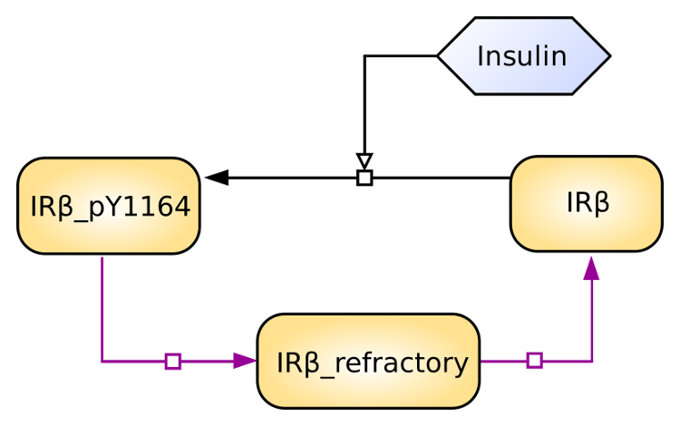
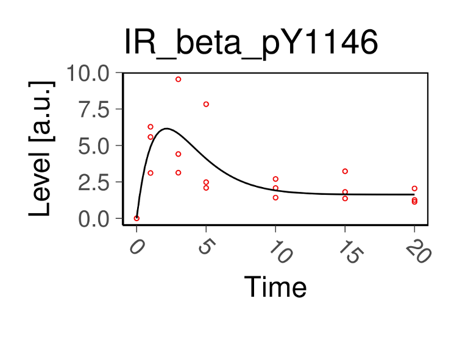
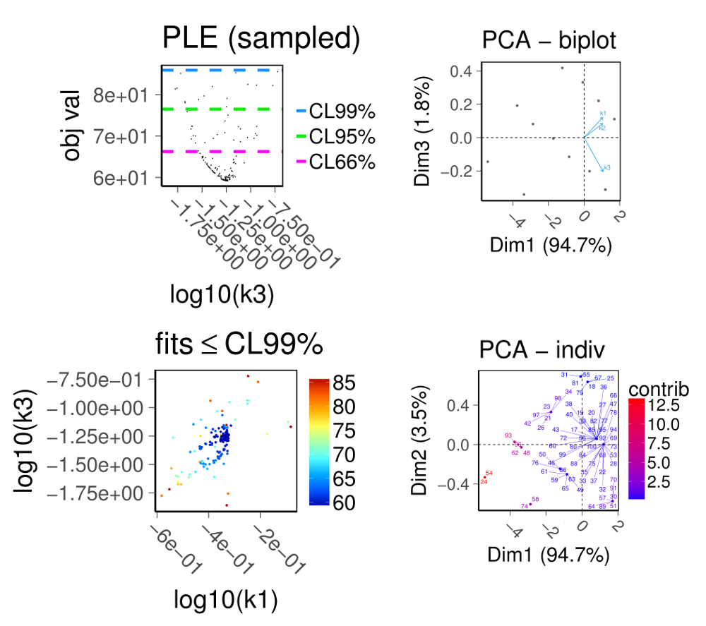

Quick examples
--------------

Here we illustrate how to use SBpipe to simulate and estimate the
parameters of a minimal model of the insulin receptor.

   Minimal model of the insulin receptor

To run this example Miniconda3 (https://conda.io/miniconda.html) must be
installed. From a GNU/Linux shell, run the following commands:

::

    # install sbpipe and its dependencies (including sbpiper)
    conda install sbpipe -c pdp10 -c conda-forge -c fbergmann -c defaults

    # install LaTeX
    conda install -c pkgw/label/superseded texlive-core=20160520 texlive-selected=20160715

    # install R dependencies (second example)
    conda install r-desolve r-minpack.lm -c conda-forge

    # create a project using the command:
    sbpipe -c quick_example

Model simulation
~~~~~~~~~~~~~~~~

This example should complete within 1 minute. For this example, the
mathematical model is coded in Python. The following model file must be
saved in ``quick_example/Models/insulin_receptor.py``.

::

    # insulin_receptor.py

    import numpy as np
    from scipy.integrate import odeint
    import pandas as pd
    import sys

    # Retrieve the report file name (necessary for stochastic simulations)
    report_filename = "insulin_receptor.csv"
    if len(sys.argv) > 1:
        report_filename = sys.argv[1]

    # Model definition
    # ---------------------------------------------
    def insulin_receptor(y, t, inp, p):
        dy0 = - p[0] * y[0] * inp[0] + p[2] * y[2]
        dy1 = + p[0] * y[0] * inp[0] - p[1] * y[1]
        dy2 = + p[1] * y[1] - p[2] * y[2]
        return [dy0, dy1, dy2]

    # input
    inp = [1]
    # Parameters
    p = [0.475519, 0.471947, 0.0578119]
    # a tuple for the arguments (see odeint syntax)
    config = (inp, p)

    # initial value
    y0 = np.array([16.5607, 0, 0])

    # vector of time steps
    time = np.linspace(0.0, 20.0, 100)

    # simulate the model
    y = odeint(insulin_receptor, y0=y0, t=time, args=config)
    # ---------------------------------------------

    # Make the data frame
    d = {'time': pd.Series(time),
         'IR_beta': pd.Series(y[:, 0]),
         'IR_beta_pY1146': pd.Series(y[:, 1]),
         'IR_beta_refractory': pd.Series(y[:, 2])}
    df = pd.DataFrame(d)

    # Write the output. The output file must be the model name with csv or txt extension.
    # Fields must be separated by TAB, and row indexes must be discarded.
    df.to_csv(report_filename, sep='\t', index=False, encoding='utf-8')

We also add a data set file to overlap the model simulation with the
experimental data. This file must be saved in
``quick_example/Models/insulin_receptor_dataset.csv``. Fields can be
separated by a TAB or a comma.

::

    Time,IR_beta_pY1146
    0,0
    1,3.11
    3,3.13
    5,2.48
    10,1.42
    15,1.36
    20,1.13
    30,1.45
    45,0.67
    60,0.61
    120,0.52
    0,0
    1,5.58
    3,4.41
    5,2.09
    10,2.08
    15,1.81
    20,1.26
    30,0.75
    45,1.56
    60,2.32
    120,1.94
    0,0
    1,6.28
    3,9.54
    5,7.83
    10,2.7
    15,3.23
    20,2.05
    30,2.34
    45,2.32
    60,1.51
    120,2.23

We then need a configuration file for SBpipe, which must be saved in
``quick_example/insulin_receptor.yaml``

::

    # insulin_receptor.yaml

    generate_data: True
    analyse_data: True
    generate_report: True
    project_dir: "."
    simulator: "Python"
    model: "insulin_receptor.py"
    cluster: "local"
    local_cpus: 4
    runs: 1
    exp_dataset: "insulin_receptor_dataset.csv"
    plot_exp_dataset: True
    exp_dataset_alpha: 1.0
    xaxis_label: "Time"
    yaxis_label: "Level [a.u.]"

Finally, SBpipe can execute the model as follows:

::

    cd quick_example
    sbpipe -s insulin_receptor.yaml

The folder ``quick_example/Results/insulin_receptor`` is now populated
with the model simulation, plots, and a PDF report.

   model simulation

Model parameter estimation
~~~~~~~~~~~~~~~~~~~~~~~~~~

This example should complete within 5 minutes. For this example, the
mathematical model is coded in R and a Python wrapper is used to invoke
this model. The model and its wrapper file must be saved in
``quick_example/Models/insulin_receptor_param_estim.r`` and
``quick_example/Models/insulin_receptor_param_estim.py``. This model
uses the data set in the previous example.

::

    # insulin_receptor_param_estim.r

    library(reshape2)
    library(deSolve)
    library(minpack.lm)

    # get the report file name
    args <- commandArgs(trailingOnly=TRUE)
    report_filename  <-  "insulin_receptor_param_estim.csv"
    if(length(args) > 0) {
      report_filename <- args[1]
    }

    # retrieve the folder of this file to load the data set file name.
    args <- commandArgs(trailingOnly=FALSE)
    SBPIPE_R <- normalizePath(dirname(sub("^--file=", "", args[grep("^--file=", args)])))

    # load concentration data
    df <- read.table(file.path(SBPIPE_R,'insulin_receptor_dataset.csv'), header=TRUE, sep=',')
    colnames(df) <- c("time", "B")

    # mathematical model
    insulin_receptor <- function(t,x,parms){
      # t: time
      # x: initial concentrations
      # parms: kinetic rate constants and the insulin input
      insulin <- 1
      with(as.list(c(parms, x)), {
          dA <- -k1*A*insulin + k3*C
          dB <- k1*A*insulin - k2*B
          dC <- k2*B - k3*C
          res <- c(dA, dB, dC)
          list(res)
      })
    }

    # residual function
    rf <- function(parms){
      # inital concentration
      cinit <- c(A=16.5607,B=0,C=0)
      # time points
      t <- seq(0,120,1)
      # parameters from the parameter estimation routine
      k1 <- parms[1]
      k2 <- parms[2]
      k3 <- parms[3]
      # solve ODE for a given set of parameters
      out <- ode(y=cinit,times=t,func=insulin_receptor,
                 parms=list(k1=k1,k2=k2,k3=k3),method="ode45")

      outdf <- data.frame(out)
      # filter the column we have data for
      outdf <- outdf[ , c("time", "B")]
      # Filter data that contains time points where data is available
      outdf <- outdf[outdf$time %in% df$time,]
      # Evaluate predicted vs experimental residual
      preddf <- melt(outdf,id.var="time",variable.name="species",value.name="conc")
      expdf <- melt(df,id.var="time",variable.name="species",value.name="conc")
      ssqres <- sqrt((expdf$conc-preddf$conc)^2)

      # return predicted vs experimental residual
      return(ssqres)
    }

    # parameter fitting using Levenberg-Marquardt nonlinear least squares algorithm
    # initial guess for parameters
    parms <- runif(3, 0.001, 1)
    names(parms) <- c("k1", "k2", "k3")
    tc <- textConnection("eval_functs","w")
    sink(tc)
    fitval <- nls.lm(par=parms,
                     lower=rep(0.001,3), upper=rep(1,3),
                     fn=rf,
                     control=nls.lm.control(nprint=1, maxiter=100))
    sink()
    close(tc)

    # create the report containing the evaluated functions
    report <- NULL;
    for (eval_fun in eval_functs) {
      items <- strsplit(eval_fun, ",")[[1]]
      rss <- items[2]
      rss <- gsub("[[:space:]]", "", rss)
      rss <- strsplit(rss, "=")[[1]]
      rss <- rss[2]
      estim.parms <- items[3]
      estim.parms <- strsplit(estim.parms, "=")[[1]]
      estim.parms <- strsplit(trimws(estim.parms[[2]]), "\\s+")[[1]]
      rbind(report, c(rss, estim.parms)) -> report
    }
    report <- data.frame(report)
    names(report) <- c("rss", names(parms))

    # write the output
    write.table(report, file=report_filename, sep="\t", row.names=FALSE, quote=FALSE)

::

    # insulin_receptor_param_estim.py

    # This is a Python wrapper used to run an R model. The R model receives the report_filename as input
    # and must add the results to it.

    import os
    import sys
    import subprocess
    import shlex

    # Retrieve the report file name
    report_filename = "insulin_receptor_param_estim.csv"
    if len(sys.argv) > 1:
        report_filename = sys.argv[1]

    command = 'Rscript --vanilla ' + os.path.join(os.path.dirname(__file__), 'insulin_receptor_param_estim.r') + \
              ' ' + report_filename

    # we replace \\ with / otherwise subprocess complains on windows systems.
    command = command.replace('\\', '\\\\')

    # Block until command is finished
    subprocess.call(shlex.split(command))

We then need a configuration file for SBpipe, which must be saved in
``quick_example/insulin_receptor_param_estim.yaml``

::

    # insulin_receptor_param_estim.yaml

    generate_data: True
    analyse_data: True
    generate_report: True
    project_dir: "."
    simulator: "Python"
    model: "insulin_receptor_param_estim.py"
    cluster: "local"
    local_cpus: 7
    round: 1
    runs: 50
    best_fits_percent: 75
    data_point_num: 33
    plot_2d_66cl_corr: True
    plot_2d_95cl_corr: True
    plot_2d_99cl_corr: True
    logspace: False
    scientific_notation: True

Finally, SBpipe can execute the model as follows:

::

    cd quick_example
    sbpipe -e insulin_receptor_param_estim.yaml

The folder ``quick_example/Results/insulin_receptor_param_estim`` is now
populated with the model simulation, plots, and a PDF report.

   model parameter estimation
